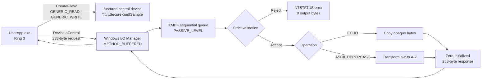

<div align="center">

# Secure KMDF Driver & User-Mode Communication

**A defensive Windows kernel communication sample using a non-PnP KMDF control device, strict fixed-size packets, and buffered bidirectional IOCTLs.**


Pure KMDF · No raw user pointers · No direct I/O · No explicit dynamic buffer allocation

</div>

## Overview

This project demonstrates a complete, bidirectional Ring-3 ↔ Ring-0 communication path for Windows 10 and Windows 11:

- a non-PnP KMDF kernel driver exposes a secured control device;
- a Win32 console client opens the device with read/write access;
- the client submits one fixed-size request with `DeviceIoControl`;
- the I/O manager transports the request through `METHOD_BUFFERED`;
- the driver validates the entire protocol envelope before processing any payload;
- the driver returns a fully initialized, fixed-size response.

The sample supports an opaque byte-for-byte echo operation and an ASCII uppercase demonstration operation. The echo path can transport caller-produced ciphertext, but this project does **not** implement cryptography, key management, authentication, or a secure network channel.

> [!IMPORTANT]
> No source sample can honestly guarantee “zero vulnerabilities.” This code minimizes common IOCTL attack surfaces, but production use still requires threat modeling, code review, fuzzing, Driver Verifier, Static Driver Verifier, signing, secure deployment, and regression testing on every supported Windows build.

## Key Features

- `METHOD_BUFFERED` only; `METHOD_NEITHER` and direct-I/O methods are not used.
- Exact request and response length checks: both buffers must be exactly 288 bytes.
- Pointer-free, architecture-stable protocol with compile-time ABI assertions.
- One-time input snapshot before output writes, preventing overlap and double-fetch mistakes.
- Strict validation of version, operation, flags, correlation ID, length, reserved fields, and zero tail.
- Fully zero-initialized responses to prevent disclosure of stale kernel memory.
- `SDDL_DEVOBJ_SYS_ALL_ADM_ALL` ACL: only LocalSystem and built-in Administrators can open the device.
- Read **and** write access bits embedded in the IOCTL definition.
- Exclusive device access and a sequential queue.
- PASSIVE_LEVEL execution contracts plus `PAGED_CODE()` checks.
- Secure zeroing of local request/response copies and device context during cleanup.
- KMDF-owned object lifetime; no explicit dynamic packet-buffer allocation in the driver.

## System Architecture



The I/O manager owns the intermediate system buffer. The driver never dereferences a user-mode pointer. Because buffered IOCTL input and output may share the same system buffer, the driver first snapshots the already size-checked request into a local kernel structure and writes the response only after validation completes.

## Quick Start

This repository is a **source-only bundle**. It intentionally contains no prebuilt `.sys`, `.cat`, `.inf`, `.vcxproj`, or `.sln` file. Create the two Visual Studio projects described below, then run the sample on a disposable Windows test machine or VM.

### 1. Requirements

| Component | Requirement |
|---|---|
| Host OS | 64-bit Windows 10 or Windows 11 |
| IDE | Visual Studio 2022 with Desktop development with C++ |
| Driver tools | A WDK version compatible with the installed Visual Studio release |
| SDK | Windows SDK selected by the WDK installer |
| Target | x64 test VM strongly recommended |
| Privileges | Elevated Administrator terminal |
| Signing | Test-signed driver for lab use; production-trusted signature for release |

### 2. Create the projects

Create a blank solution named `SecureKmdfSample` with two projects:

1. **Driver project**
   - Template: **Kernel Mode Driver, Empty (KMDF)**
   - Project name: `SecureKmdfSample`
   - Add `Driver.c`, `Device.c`, `Queue.c`, and `Public.h`.
   - Keep the source files compiled as C.
   - Select an x64 Windows 10/11 target and a KMDF version supported by that target.

2. **Client project**
   - Template: **Console App**
   - Project name: `UserApp`
   - Add `UserApp.cpp` and the shared `Public.h`.
   - Set **C++ Language Standard** to C++17 or newer.
   - Set **Character Set** to Unicode.

The driver is non-PnP and creates its own named control device. No hardware ID or device node is required.

### 3. Build

Select `Debug | x64` and choose **Build → Build Solution**. Exact output directories depend on the solution layout; typical outputs are:

```text
x64\Debug\SecureKmdfSample.sys
x64\Debug\UserApp.exe
```

### 4. Copy, register, start, and run

Open an **elevated x64 Native Tools Command Prompt**:

```bat
mkdir C:\Drivers\SecureKmdf
copy /Y .\x64\Debug\SecureKmdfSample.sys C:\Drivers\SecureKmdf\

sc.exe create SecureKmdfSample type= kernel start= demand error= normal ^
  binPath= C:\Drivers\SecureKmdf\SecureKmdfSample.sys

sc.exe start SecureKmdfSample
.\x64\Debug\UserApp.exe "hello from ring 3"
```

The current client prints:

```text
Input    : hello from ring 3
Response : HELLO FROM RING 3
```

## Build Methods

### Method A — Visual Studio GUI

1. Open `SecureKmdfSample.sln`.
2. Select `Debug | x64` for development or `Release | x64` for a release candidate.
3. Build the driver project, then the client project.
4. Check **View → Output → Build** for WDK, compiler, linker, and signing errors.
5. Locate the generated `SecureKmdfSample.sys` and `UserApp.exe` under the configured output directories.

Use **Build → Clean Solution** before changing WDK/KMDF target versions to avoid stale framework metadata.

### Method B — MSBuild from a Developer Command Prompt

Run from a Visual Studio Developer Command Prompt after the projects exist:

```bat
msbuild .\SecureKmdfSample.sln /t:Clean,Build ^
  /p:Configuration=Debug /p:Platform=x64
```

Build only one project when diagnosing:

```bat
msbuild .\SecureKmdfSample\SecureKmdfSample.vcxproj /t:Build ^
  /p:Configuration=Debug /p:Platform=x64

msbuild .\UserApp\UserApp.vcxproj /t:Build ^
  /p:Configuration=Debug /p:Platform=x64
```

### Method C — Compile the client directly with `cl.exe`

The user-mode client does not require a Visual Studio project:

```bat
cd SecureKmdf
cl.exe /nologo /EHsc /W4 /std:c++17 UserApp.cpp /Fe:UserApp.exe
```

This builds only `UserApp.exe`. The kernel driver still requires a WDK driver project or an equivalent WDK/MSBuild environment.

### Method D — Enterprise WDK

The Enterprise WDK (EWDK) provides a command-line build environment without a full Visual Studio IDE. Mount the EWDK ISO, launch its build environment, and build the solution:

```bat
X:\LaunchBuildEnv.cmd
cd /d C:\src\SecureKmdf
msbuild .\SecureKmdfSample.sln /t:Clean,Build ^
  /p:Configuration=Debug /p:Platform=x64
```

Replace `X:` with the mounted EWDK drive. The solution/project files must already exist and target toolsets available in that EWDK image.

## Driver Signing and Test Mode

Windows x64 kernel-mode code integrity normally refuses an unsigned driver. For an isolated development VM, let Visual Studio/WDK create a test certificate and test-sign the driver package or image.

If test mode is required, run these commands in an elevated terminal and reboot:

```bat
bcdedit.exe /set TESTSIGNING ON
shutdown.exe /r /t 0
```

Verify that the desktop displays the Test Mode watermark, then inspect the image signature:

```bat
signtool.exe verify /v /kp C:\Drivers\SecureKmdf\SecureKmdfSample.sys
```

> [!WARNING]
> Use test mode only on a lab machine. Secure Boot policy can block changes to `TESTSIGNING`. Memory Integrity/HVCI can still reject an unsigned image, so keep the driver genuinely test-signed. Do not disable platform security controls on a production workstation merely to load this sample.

To turn test mode off after testing:

```bat
bcdedit.exe /set TESTSIGNING OFF
shutdown.exe /r /t 0
```

## Driver Installation and Execution Methods

### Method 1 — Service Control Manager from Command Prompt

This is the canonical path for the current non-PnP, source-only sample:

```bat
mkdir C:\Drivers\SecureKmdf
copy /Y SecureKmdfSample.sys C:\Drivers\SecureKmdf\

sc.exe create SecureKmdfSample type= kernel start= demand error= normal ^
  binPath= C:\Drivers\SecureKmdf\SecureKmdfSample.sys

sc.exe start SecureKmdfSample
sc.exe query SecureKmdfSample
```

Important `sc.exe` syntax rules:

- include a space after every option's equals sign, for example `type= kernel`;
- use an absolute `binPath`;
- keep the service name consistent in every command;
- use `start= demand` so the sample does not load automatically at boot.

### Method 2 — Service Control Manager from PowerShell

Use `sc.exe` explicitly. In Windows PowerShell, plain `sc` can resolve to the `Set-Content` alias.

```powershell
New-Item -ItemType Directory -Force C:\Drivers\SecureKmdf | Out-Null
Copy-Item .\SecureKmdfSample.sys C:\Drivers\SecureKmdf\ -Force

sc.exe create SecureKmdfSample type= kernel start= demand `
  error= normal `
  binPath= C:\Drivers\SecureKmdf\SecureKmdfSample.sys

sc.exe start SecureKmdfSample
sc.exe query SecureKmdfSample
```

### Method 3 — Visual Studio test-target deployment

Visual Studio can copy and deploy a driver package to a configured test computer:

1. Open **Driver → Test → Configure Computers**.
2. Add a disposable VM and complete WDK test-target provisioning.
3. Add a driver package/deployment project if you want Visual Studio-managed deployment.
4. Configure deployment in the driver project's **Driver Install → Deployment** properties.
5. Build and choose **Deploy Solution**.

The supplied bundle has no INF/package project, so Visual Studio cannot infer an installation recipe from these five source files alone. For this non-PnP build, use the SCM commands above after copying the `.sys`, or add explicit deployment hooks that create/start the kernel service.

### Why not PnPUtil or DevCon?

`PnPUtil` and `DevCon` operate on driver packages and Plug and Play device nodes. This driver is deliberately non-PnP and the bundle has no INF. They are therefore **not** the default loader for the current project. If you later convert it to a PnP device or add a package for enterprise deployment, document that package's hardware IDs, service section, catalog, and signing flow separately.

## Running the User-Mode Client

The driver service must be running, and the terminal must be elevated because the device ACL permits only LocalSystem and Administrators.

### Command Prompt

```bat
UserApp.exe
UserApp.exe "hello kernel"
UserApp.exe "mixed Case 123"
```

With no argument, the client sends its built-in UTF-16 string after strict UTF-8 conversion. With an argument, the UTF-8 representation must be no more than 256 bytes.

### PowerShell

```powershell
.\UserApp.exe
.\UserApp.exe "hello from PowerShell"
```

### Visual Studio debugger

1. Set `UserApp` as the startup project.
2. Open **Project Properties → Debugging**.
3. Set **Command Arguments** to `"hello from Visual Studio"`.
4. Start Visual Studio as Administrator.
5. Ensure `SecureKmdfSample` is already running.
6. Press **F5**.

### Sending opaque or encrypted bytes

`MY_OPERATION_ECHO` returns the payload unchanged and is suitable for opaque caller-generated bytes. `MY_OPERATION_ASCII_UPPERCASE` modifies lowercase ASCII byte values and must **not** be used for ciphertext.

The included client currently selects:

```cpp
request.Operation = MY_OPERATION_ASCII_UPPERCASE;
```

To exercise echo with this demo client, change that line to:

```cpp
request.Operation = MY_OPERATION_ECHO;
```

Then rebuild `UserApp.exe`. For arbitrary binary input, replace the text conversion layer with a binary-safe source while preserving every protocol invariant and exact buffer length.

## Service Lifecycle

| Action | Command |
|---|---|
| Create | `sc.exe create SecureKmdfSample type= kernel start= demand binPath= C:\Drivers\SecureKmdf\SecureKmdfSample.sys` |
| Start | `sc.exe start SecureKmdfSample` |
| Query | `sc.exe query SecureKmdfSample` |
| Stop | `sc.exe stop SecureKmdfSample` |
| Delete registration | `sc.exe delete SecureKmdfSample` |

If `sc.exe create` reports that the service already exists, query it first. Stop and delete the old registration before recreating it with a different path.

## Source Components

| File | Responsibility |
|---|---|
| `Public.h` | Shared ABI, device names, IOCTL, operation IDs, packet structures, compile-time size/method assertions |
| `Driver.c` | `DriverEntry`, non-PnP KMDF configuration, four-byte pool tag, driver context, unload path |
| `Device.c` | Secured control-device creation, exclusive access, symbolic link, cleanup callback |
| `Queue.c` | Sequential PASSIVE_LEVEL queue, exact buffer checks, validation, processing, completion |
| `UserApp.cpp` | RAII handle management, UTF-8 conversion, request creation, `DeviceIoControl`, response validation, secure clearing |

## Device and Protocol Contract

### Names

| Layer | Value |
|---|---|
| NT device object | `\Device\SecureKmdfSample` |
| Global DOS symbolic link | `\DosDevices\Global\SecureKmdfSample` |
| Win32 open path | `\\.\SecureKmdfSample` |
| Example service name | `SecureKmdfSample` |

The driver sets the device as exclusive, so only one open handle is allowed at a time.

### IOCTL definition

```c
#define IOCTL_MY_PROCESS_PACKET \
    CTL_CODE(FILE_DEVICE_UNKNOWN, 0x800, METHOD_BUFFERED, \
             (FILE_READ_ACCESS | FILE_WRITE_ACCESS))
```

- `FILE_DEVICE_UNKNOWN` identifies a private control device.
- Function `0x800` is in the vendor-reserved range.
- `METHOD_BUFFERED` prevents the driver from receiving a raw user pointer.
- `FILE_READ_ACCESS | FILE_WRITE_ACCESS` requires a handle opened with both `GENERIC_READ` and `GENERIC_WRITE`.

### Fixed wire layout

Both structures use natural Windows ABI alignment and are exactly **288 bytes**.

| Offset | Size | Request field | Response field | Validation |
|---:|---:|---|---|---|
| 0 | 4 | `StructSize` | `StructSize` | Must be 288 |
| 4 | 4 | `Version` | `Version` | Must be 1 |
| 8 | 4 | `Operation` | `Operation` | Echo or uppercase |
| 12 | 4 | `Flags` | `Result` | Request flags must be zero |
| 16 | 8 | `CorrelationId` | `CorrelationId` | Request value must be nonzero and round-trip unchanged |
| 24 | 4 | `PayloadLength` | `PayloadLength` | 0–256 |
| 28 | 4 | `Reserved` | `Reserved` | Must be zero |
| 32 | 256 | `Payload` | `Payload` | Unused tail must be zero |

The shared header asserts the ABI at compile time for both C and C++ builds. Do not add pointers, `size_t`, handles, flexible arrays, compiler-dependent bit fields, or architecture-sized types to this wire format.

### Operations

| ID | Symbol | Behavior |
|---:|---|---|
| 1 | `MY_OPERATION_ECHO` | Returns exactly `PayloadLength` opaque bytes unchanged |
| 2 | `MY_OPERATION_ASCII_UPPERCASE` | Converts only ASCII `a`–`z` to `A`–`Z` |

The uppercase operation is byte-oriented. It does not perform locale-aware or Unicode case conversion.

## Validation Pipeline

Every accepted request passes the following sequence:

1. Reject unknown IOCTL codes.
2. Require `InputBufferLength == sizeof(MY_PACKET_REQUEST)`.
3. Require `OutputBufferLength == sizeof(MY_PACKET_RESPONSE)`.
4. Retrieve KMDF buffers with minimum sizes.
5. Recheck the lengths returned by KMDF.
6. Copy the complete request once before any output write.
7. Validate structure size and protocol version.
8. Require zero flags and reserved field.
9. Require a nonzero correlation ID.
10. Allow only the two documented operations.
11. Require `PayloadLength <= 256`.
12. Require every unused payload byte to be zero.
13. Build the response from a zeroed local structure.
14. Copy exactly 288 response bytes and report exactly 288 bytes completed.
15. Securely wipe both local packet copies.

On failure, the request completes with an NTSTATUS error and zero bytes of output information.

## Security Model

| Control | Implementation | Threat reduced |
|---|---|---|
| Buffered transport | `METHOD_BUFFERED` | User-pointer dereference, direct user-buffer access |
| Exact lengths | Strict equality checks | Truncation, oversized messages, version confusion |
| Stable ABI | Fixed-width pointer-free fields | 32/64-bit layout drift, embedded pointer abuse |
| One-time snapshot | Local request copy | Shared-buffer overlap and double-fetch mistakes |
| Canonical encoding | Zero flags/reserved/tail | Hidden trailing data and ambiguous encodings |
| Output initialization | Zeroed response before use | Kernel memory disclosure |
| Device ACL | `SDDL_DEVOBJ_SYS_ALL_ADM_ALL` | Access by standard users |
| IOCTL access mask | Read and write required | Calls from underprivileged handles |
| Exclusive device | `WdfDeviceInitSetExclusive(TRUE)` | Multi-handle state races |
| Sequential dispatch | `WdfIoQueueDispatchSequential` | Concurrent request races |
| IRQL discipline | PASSIVE_LEVEL + `PAGED_CODE()` | Pageable-code execution at elevated IRQL |
| Cleanup | WDF parent/child lifetime + secure zeroing | Leaks and residual sensitive data |

The driver does not call `ExAllocatePoolWithTag` or `ExAllocatePool2` because packet processing needs no dynamic allocation. KMDF owns the framework objects. The configured four-byte driver pool tag is `MydT` as displayed by little-endian pool tools.

## Project Structure

```text
SecureKmdf/
├── Driver.c       # Driver entry, KMDF configuration, unload
├── Device.c       # Secure non-PnP control device
├── Queue.c        # IOCTL queue, validation, processing
├── Public.h       # Shared kernel/user protocol
├── UserApp.cpp    # Win32 console client
└── README.md      # Build, run, test, and security guide
```

## Verification and Testing

Always test kernel code in a disposable VM with a snapshot.

### Positive tests

```bat
UserApp.exe ""
UserApp.exe "abc XYZ 123"
UserApp.exe "exact protocol smoke test"
```

Confirm that ASCII lowercase letters are uppercased, all other payload bytes round-trip unchanged, the response length is 288, and the correlation ID matches.

### Access-control negative test

Start the driver from an elevated session, then launch `UserApp.exe` from a standard, non-elevated account. `CreateFileW` should fail with `ERROR_ACCESS_DENIED`.

### Malformed packet tests

A dedicated test harness or IOCTL fuzzer should cover:

- every input/output length from 0 through at least 512 bytes;
- unknown IOCTL values;
- invalid structure size or protocol version;
- unknown operation IDs;
- nonzero flags or reserved values;
- zero correlation ID;
- payload lengths above 256;
- nonzero bytes after `PayloadLength`;
- repeated open/close and load/unload cycles;
- concurrent callers, even though the device is exclusive;
- cancellation and process termination during I/O.

### Driver Verifier

Enable Driver Verifier **only on a test machine**. It intentionally bug-checks the system when it detects a violation.

```bat
verifier.exe /standard /driver SecureKmdfSample.sys
shutdown.exe /r /t 0
```

After reboot:

```bat
verifier.exe /querysettings
verifier.exe /query
```

Disable it after testing:

```bat
verifier.exe /reset
shutdown.exe /r /t 0
```

### Kernel debugging with WinDbg

Attach WinDbg to the test VM using a supported kernel-debug transport, configure Microsoft symbols, and set a breakpoint on the IOCTL callback:

```text
.symfix
.reload
lm m SecureKmdfSample
bu SecureKmdfSample!MyEvtIoDeviceControl
g
```

Trigger `UserApp.exe` in the target VM. Inspect NTSTATUS values and lengths, but never copy sensitive payloads into public logs or screenshots.

### Static analysis

Run the checks available in your WDK/Visual Studio version:

- Microsoft Code Analysis for Drivers;
- Static Driver Verifier rules applicable to KMDF;
- compiler warnings at a high warning level;
- architecture builds for every supported target;
- a protocol-aware user-mode fuzzer.

## Troubleshooting

| Symptom | Likely cause | Resolution |
|---|---|---|
| `OpenService FAILED 1060` | Service was not created | Run `sc.exe create` from an elevated terminal |
| `CreateService FAILED 1073` | Service already exists | Query, stop, and delete the old service or reuse it |
| `StartService FAILED 2` | Wrong `binPath` or missing `.sys` | Use an absolute path and verify the file exists |
| `StartService FAILED 5` | Terminal is not elevated or policy blocks loading | Use an Administrator terminal and inspect Code Integrity logs |
| `StartService FAILED 577` | Signature/code-integrity failure | Test-sign correctly; verify certificate, Secure Boot, and HVCI policy |
| `StartService FAILED 87` | Bad service syntax or driver initialization failure | Check spaces after `sc.exe` options and inspect kernel debugger/Event Viewer output |
| `CreateFileW: ERROR_FILE_NOT_FOUND` | Driver is not started or link was not created | Query the service; debug `DriverEntry` and device creation |
| `CreateFileW: ERROR_ACCESS_DENIED` | Caller is not elevated or handle access is wrong | Run as Administrator and request both read and write access |
| `CreateFileW: ERROR_SHARING_VIOLATION` | Another process owns the exclusive handle | Close the other client and retry |
| `DeviceIoControl: ERROR_INSUFFICIENT_BUFFER` | Output is not exactly 288 bytes | Use `sizeof(MY_PACKET_RESPONSE)` |
| `DeviceIoControl: ERROR_INVALID_PARAMETER` | Protocol invariant failed | Check exact sizes, version, operation, correlation ID, length, reserved fields, and zero tail |
| Driver will not stop | A client still holds a handle or request | Close clients, wait for I/O to complete, then stop again |

Useful diagnostics:

```bat
sc.exe qc SecureKmdfSample
sc.exe queryex SecureKmdfSample
driverquery.exe /v | findstr /i SecureKmdfSample
```

Also inspect **Event Viewer → Applications and Services Logs → Microsoft → Windows → CodeIntegrity → Operational** for signature and policy failures.

## Uninstall and Cleanup

Close `UserApp.exe` and any other process holding the exclusive device handle, then run:

```bat
sc.exe stop SecureKmdfSample
sc.exe delete SecureKmdfSample
```

After deletion succeeds, remove the copied binary:

```bat
del C:\Drivers\SecureKmdf\SecureKmdfSample.sys
rmdir C:\Drivers\SecureKmdf
```

If the service is marked for deletion, close service-management tools and reboot the test VM before trying again.

## Production Hardening Checklist

- Replace the sample operation with a documented, versioned production protocol.
- Define a threat model and trust boundary for every payload field.
- Use the narrowest SDDL and IOCTL access mask appropriate for the real product.
- Add per-operation authorization if Administrator membership is too broad.
- Use Windows-supported cryptography and key storage; never embed a static secret in the driver.
- Add replay protection if correlation IDs become security-relevant.
- Add checked arithmetic before introducing variable-sized fields or allocations.
- Keep callbacks nonpageable if future code must run above PASSIVE_LEVEL.
- Add cancellation, timeout, and teardown logic before introducing asynchronous work.
- Fuzz every protocol version and operation.
- Run Driver Verifier, static analysis, and HLK/attestation requirements appropriate to the distribution channel.
- Create a signed INF/CAT package when your deployment model requires one.
- Establish secure update, rollback, telemetry, and incident-response procedures.
- Add an explicit open-source or proprietary license before redistributing the project.

## Limitations

- The sample is non-PnP and has no INF/package project.
- The bundle contains source only; no prebuilt or signed driver is provided.
- The control device is exclusive, so it intentionally supports one open handle.
- The queue is sequential; throughput is secondary to a simple race-resistant model.
- The uppercase operation is ASCII-only.
- `MY_OPERATION_ECHO` provides transport, not encryption or authentication.
- The sample does not persist state across unload/reload.
- The console application and all source-level messages are in English.

## References

- [Building a driver with the WDK](https://learn.microsoft.com/en-us/windows-hardware/drivers/develop/building-a-driver)
- [Installing a non-PnP KMDF driver](https://learn.microsoft.com/en-us/windows-hardware/drivers/wdf/installing-a-non-pnp-driver)
- [Defining I/O control codes](https://learn.microsoft.com/en-us/windows-hardware/drivers/kernel/defining-i-o-control-codes)
- [Accessing data buffers in WDF drivers](https://learn.microsoft.com/en-us/windows-hardware/drivers/wdf/accessing-data-buffers-in-wdf-drivers)
- [Test-signing boot configuration](https://learn.microsoft.com/en-us/windows-hardware/drivers/install/the-testsigning-boot-configuration-option)
- [`sc.exe create`](https://learn.microsoft.com/en-us/windows-server/administration/windows-commands/sc-create)
- [Driver Verifier](https://learn.microsoft.com/en-us/windows-hardware/drivers/devtest/driver-verifier)
- [Getting started with WinDbg kernel-mode debugging](https://learn.microsoft.com/en-us/windows-hardware/drivers/debugger/getting-started-with-windbg--kernel-mode-)

## License

No license file is included in this source bundle. Add an explicit license before public redistribution so readers know what they are permitted to copy, modify, and redistribute.
